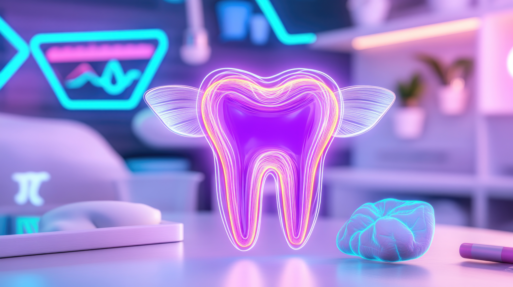

# Dr. KD Hariparsad Dental Practice Website

Professional website for Dr. KD Hariparsad's dental practice in Newcastle, South Africa. This responsive website showcases services, practice information, and contact details to help patients connect with the practice.

## Table of Contents
- [Features](#features)
- [Technologies Used](#technologies-used)
- [SEO Optimization](#seo-optimization)
- [Performance](#performance)
- [Accessibility](#accessibility)
- [Installation](#installation)
- [License](#license)

## Features

### Modern, Responsive Design
- Fully responsive layout that works on all devices
- Mobile-first approach with optimized touch targets
- Clean, professional color scheme and typography

### Key Sections
1. **Hero Section**: Engaging introduction with call-to-action
2. **Services**: Detailed showcase of dental services in three categories
3. **About**: Practice information and team bios
4. **Facebook Integration**: Connection to practice's social media
5. **FAQ Section**: FAQ section for common patient questions
6. **Location**: Interactive map and practice hours
7. **Contact**: Multiple contact options (phone, email, WhatsApp)

### Technical Highlights
- Semantic HTML5 markup
- CSS3 with modern layout techniques (Flexbox, Grid)
- Responsive images with lazy loading
- Smooth scrolling navigation
- Animated elements with AOS library
- Schema.org structured data for better search visibility

## Technologies Used

### Core
- HTML5
- CSS3
- JavaScript (ES6)

### Libraries
- [AOS (Animate On Scroll)](https://michalsnik.github.io/aos/) - For scroll animations
- [Font Awesome](https://fontawesome.com/) - For icons
- Google Fonts (Open Sans, Playfair Display)

### Optimization
- Preloading critical resources
- Lazy loading for non-critical images
- Minimized render-blocking resources
- Optimized CSS delivery

## SEO Optimization

### On-Page SEO
- Semantic HTML structure
- Optimized meta tags (title, description, keywords)
- Canonical URL
- Robots meta tag
- Open Graph and Twitter Card meta tags

### Technical SEO
- Schema.org markup for dental practice
- Mobile-friendly design
- Fast loading times
- Secure connections (HTTPS ready)

### Local SEO
- Complete NAP (Name, Address, Phone) information
- Google Maps integration
- Local business schema markup

## Performance

### Optimizations
- Preconnected to external domains
- Preloaded hero image
- Critical CSS inlined
- Non-critical CSS loaded asynchronously
- Lazy-loaded Google Maps iframe

### Performance Targets
- Mobile-first design
- Optimized image delivery
- Minimal JavaScript footprint
- Efficient animations

## Accessibility

### Features
- Semantic HTML structure
- Proper heading hierarchy
- Sufficient color contrast
- Accessible form controls
- Keyboard navigable
- ARIA attributes where needed
- Reduced motion options

## Credits
Website developed by [Spectra Studios](https://spectrastudios.co.za)

## License
This website is the property of Dr. KD Hariparsad and Spectra Studios. All content is copyrighted.
